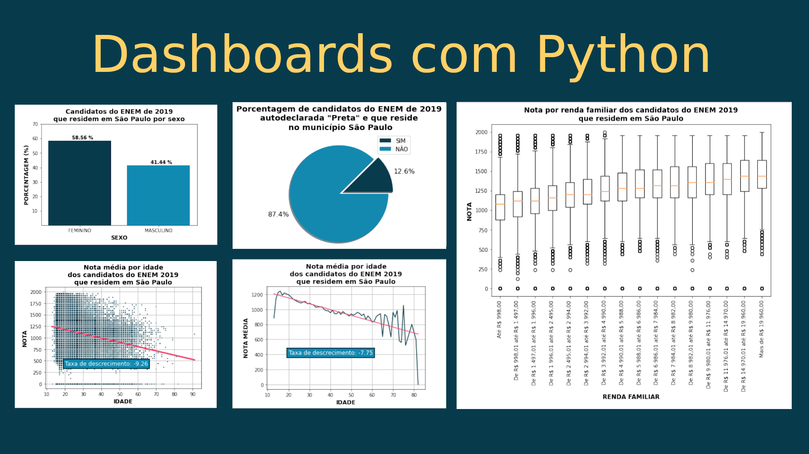

# Análise exploratória de dados com Python

Neste projeto estudaremos os cinco principais gráficos para uma análise exploratória de dados (EDA): barras, pizza (ou donut), dispersão, linha e boxplot.

Para tal tarefa utilizaremos o conjunto de dados do Enem e as bibliotecas Pandas e Matplotlib escritas na linguagem de programação Python.

O estudo será guiado por perguntas sobre o conjunto de dados considerado.

## Ambiente (Ubuntu 20.04)

- Crie o ambiente virtual na pasta do projeto: `/usr/bin/python3.8 -m venv env`
- Ative o ambiente virtual: `source env/bin/activate`
- Instale as dependências: `pip install pandas matplotlib scikit-learn`
- Instale o Jupyter Notebook: `pip install jupyter`
- Abra o Jupyter Notebook: `jupyter-notebook`
- Já no Jupyter Notebook, clique em *new* e depois em *Python 3* para criar seu primeiro kernel.
- Clique em *File*, depois em *Rename* e dê o nome de *eda-parte-01-matplotlib*.

## Tutorial

Para começar, basta acessar o notebook *eda-parte-01-matplotlib.ipynb* deste repositório.

<h1 align="center">
  
</h1>

Bons estudos!

